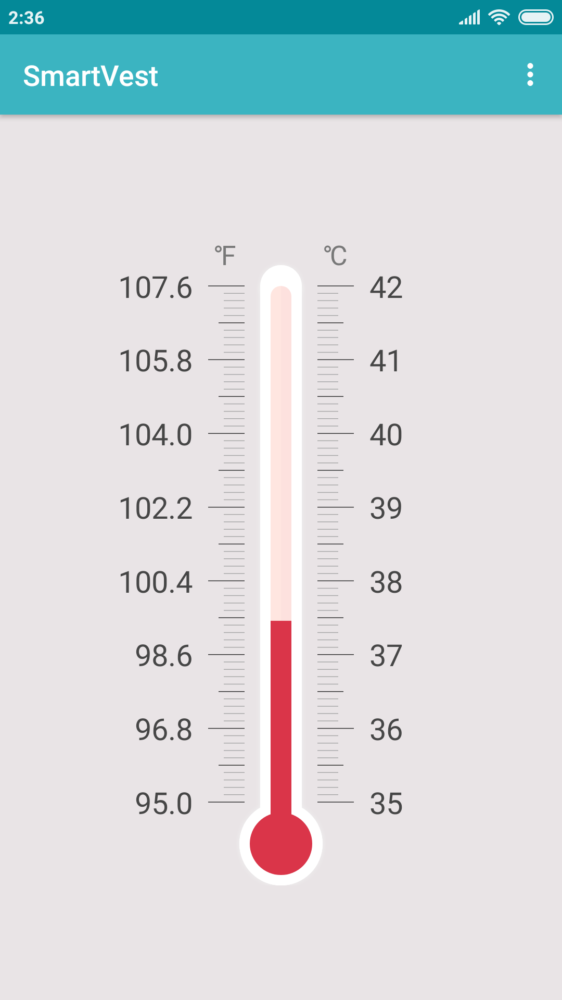
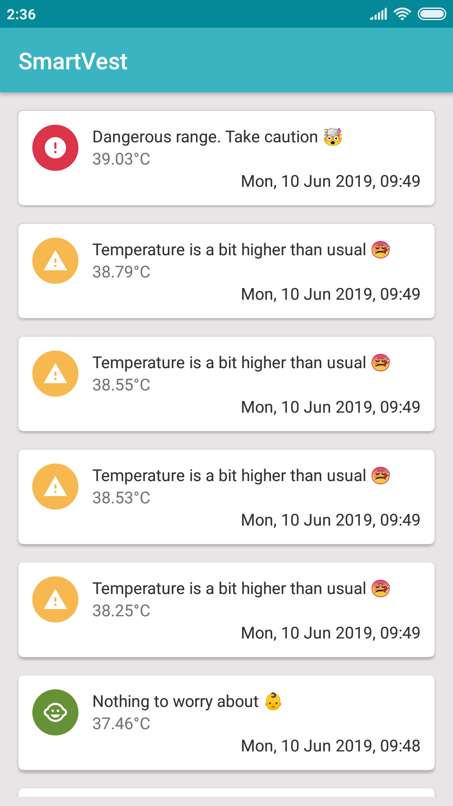
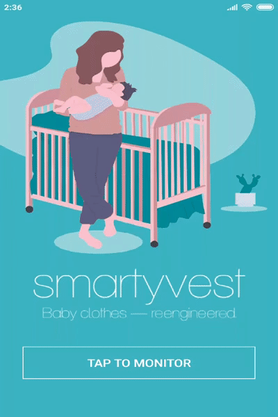

# SmartVest!


## About

SmartVest Android application lets you monitor your baby's body temperature. It works with Smart Device which was built with **ESP8266** and **DS18B20** temperature sensor. Basically, IoT device measures in every 10 seconds and push the data to Firebase Realtime Database. The application watches the database and update the UI real-time. It was my senior design project at ITU.


## Screenshots
<p float="left">



</p>



## Configuration

To run the app, you need to create a Firebase project and Realtime Database. Then modify `google-services.json` file in the app module. Add the data from the Firebase dashboard and the app will automatically update the UI. If the threshold is reached, alerting notification is pushed.  
`
## Firebase Data Structure

An example structure looks like that
```json
{
  "logs" : {
    "-LfJuvNiUvcP9_xca8IB" : {
      "temp" : 36.15,
      "timestamp" : 1558350378542
    },
    "-LfJuyfMv4V8u1EBeqIh" : {
      "temp" : 36.23,
      "timestamp" : 1558350392023
    },
    "-LfJv3ocB1cEiNEe7KKb" : {
      "temp" : 36.68,
      "timestamp" : 1558350417192
    }
}
```
